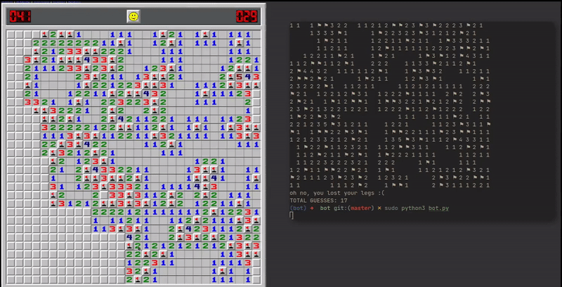

# Minesweeper bot

To start the bot you need to enter the environment

~~~ bash

source bot/bin/activate

~~~

then simply start the bot with 

~~~ bash

sudo python3 bot.py

~~~

this bot is configured to be used at https://minesweeperonline.com/#150-left with  150% zoom. You may need to tweak some settings to get it working on your local machine.  
Use `test.py` to check mouseposition and colors

